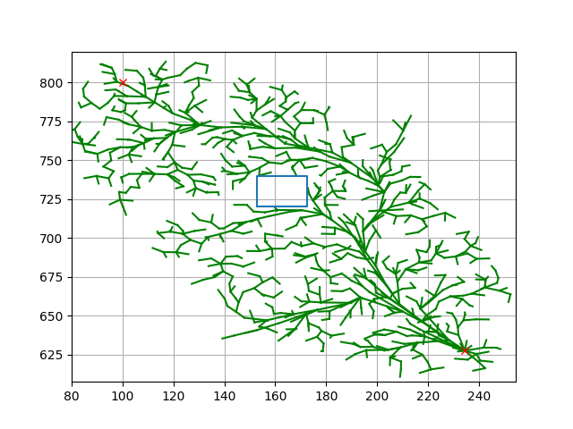
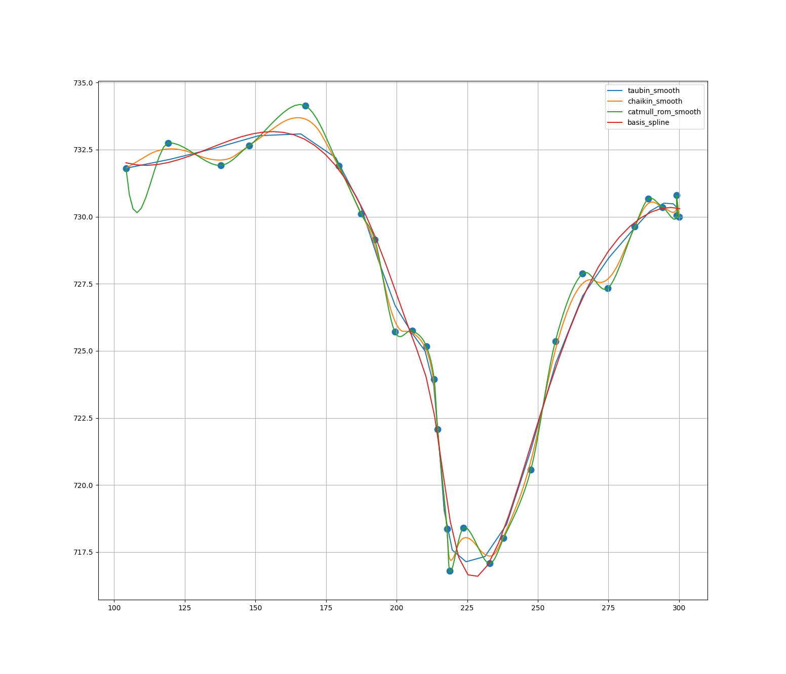
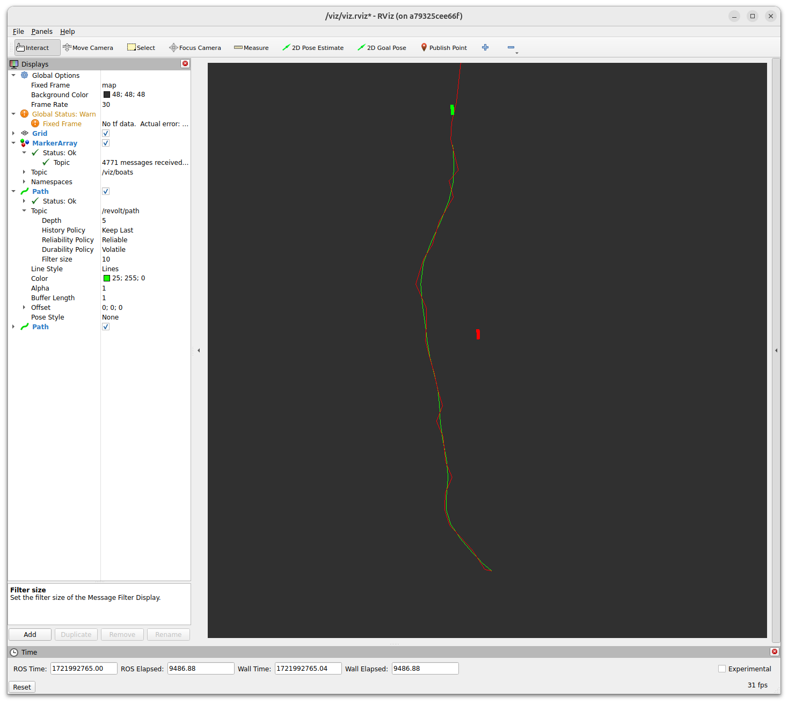

# Commander
A simple, pure python, navigation project using [NAV2](https://docs.nav2.org/index.html)'s [Simple Commander API](https://docs.nav2.org/commander_api/index.html#id1)


## Environment
This was developed for use with DNV's ReVolt ship simulator, but you can also use the simplified linear kinematic model in `./src/commander/commander/mock_boat.py`


## Waypoint manager
`./src/commander/commander/exec.py`

Minimal waypoint manager based on [NAV2 navigation concepts](https://docs.nav2.org/concepts/index.html)
## InformedRRT*
`./src/commander/actions/compute_path_to_pose_server.py`



[Informed RRT*: Optimal Sampling-based Path Planning Focused via Direct Sampling of an Admissible Ellipsoidal Heuristic](https://arxiv.org/pdf/1404.2334)

## Path smooting
`./src/commander/actions/smooth_path_server.py`



You can choose between
```python
class SmootherType(Enum):
    TAUBIN = 0
    CHAIKIN = 1
    CATMULL_ROM = 2
    B_SPLINE = 3
```
Articles:

[Taubin, G., Curve and Surface Smoothing without Shrinkage.](https://graphics.stanford.edu/courses/cs468-01-fall/Papers/taubin-smoothing.pdf)

[Multi-step Subdivision Algorithm for Chaikin Curves.](https://sci-hub.st/10.1007/978-3-540-30497-5_188)

[Edwin Catmull., A Class of Local Interpolating Splines](https://sci-hub.hkvisa.net/10.1016/b978-0-12-079050-0.50020-5)

[Boor, Carl., On Calculating with B-Splines](https://web.stanford.edu/class/cme324/classics/deboor.pdf)

## Visualization
Start rviz2 by running `./src/ros2-viz-docker/run.sh`


